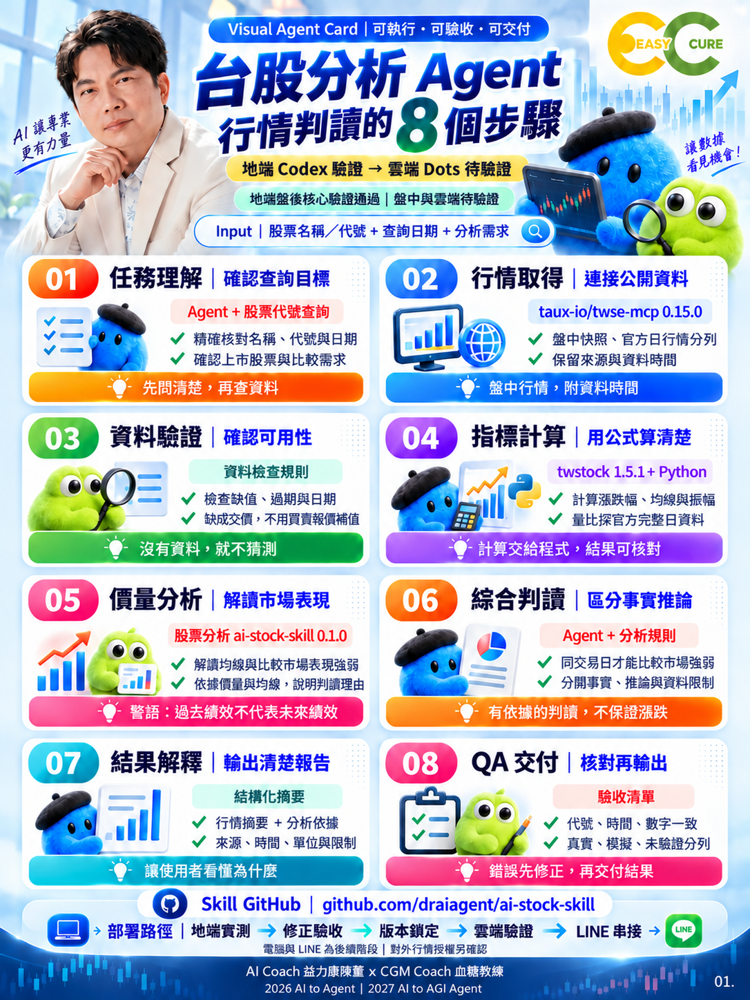

# ai-to-agent-tw-stock-agent

**台股分析 Agent｜VAC 任務圖卡、使用方式與驗收教材**

版本：0.1.0｜日期：2026-10-06｜類型：Agent 任務規格＋教學教材。

讓學習者用一張圖卡交付台股查詢任務，理解資料驗證、價量分析與結果覆核。



## 兩個 Repo 如何分工

|Repo|用途|
|---|---|
|[ai-stock-skill](https://github.com/draiagent/ai-stock-skill)|程式、Skill、依賴與計算測試的正式來源|
|ai-to-agent-tw-stock-agent（本 Repo）|VAC、約 1,000 字使用方式、任務指令與驗收紀錄|

本 Repo 不複製分析引擎，也不需要獨立安裝金融依賴。技能基準為 ai-stock-skill 0.1.0；遠端 main 可能更新，實作時記錄下載 commit，不能只憑 VERSION 判定檔案完全相同。

## 開始使用

1. 閱讀 [使用方式](docs/usage.md) 與 [VAC 文字規格](docs/vac-spec.md)。
2. 下載完整 ai-stock-skill Repo，在地端 Codex 開啟其根目錄。
3. 依該 Repo 的 README 建立 Windows 隔離環境；確認 Skill 啟用與路徑。
4. 上傳本圖卡，貼上 [執行指令](docs/codex-task.md)，取得報告。
5. 對照 [驗收表](ACCEPTANCE.md)；保存資料時間、來源、錯誤與未完成項目。

具 Git 與 Windows Python 環境時，可在工作目錄操作：

```powershell
git clone https://github.com/draiagent/ai-stock-skill.git
cd ai-stock-skill
git rev-parse HEAD
./install.ps1
./run.ps1 '查台積電 2330'
./run.ps1 '比較台積電 2330、聯發科 2454'
.venv/Scripts/python.exe -m unittest -v test_agent
```

以上命令依已讀取的上游 README 整理；本輪未重新安裝或連線測試。不要將本教材目錄誤當程式目錄。

## 輸入、輸出與完成標準

輸入：1–5 個四碼上市股票代號、單一日期、單股／比較需求。名稱捷徑支援台積電與聯發科。

輸出：上游程式在 runs/ 產生 report.md、report.json、raw/ 與來源雜湊紀錄。

完成標準：代號正確、時間清楚、同日比較、成交量口徑一致、缺值不補造、事實與推論分開。退出碼 0 不代表資料全部完整。

## 本次實測狀態

使用者提供地端 Codex 回報：環境與安裝、Skill 辨識啟用、三類真實 API 查詢、19 項模擬測試均 PASS。本輪將此列為「依回報通過」，未獨立重跑。

原發布雜湊為 FAIL，使用者說明已附修正檔；本輪實際收到圖卡，尚未收到可識別修正檔，因此不宣稱第一個 Repo 已修復。本 Repo 檔案完成後另產生自己的 SHA256SUMS.json，驗證方式見 [發布檢查](docs/release-checklist.md)。

## 目錄

- [VAC 圖卡](assets/tw-stock-agent-vac.png)
- [約 1,000 字使用方式](docs/usage.md)
- [八步驟規格](docs/vac-spec.md)
- [Codex 執行指令](docs/codex-task.md)
- [教學與企業使用](docs/teaching-enterprise.md)
- [驗收紀錄](ACCEPTANCE.md)、[使用者實測回報](evidence/user-validation.md)
- [版本紀錄](CHANGELOG.md)、[發布說明](docs/release-notes.md)、[GitHub 設定](docs/github-publish.md)
- [雜湊工具](scripts/checksums.py)、SHA256SUMS.json

## 範圍與後續

目前為地端盤後流程教材。真實盤中、跨平台、雲端常駐、LINE 與生產環境仍待驗證；圖卡底部是後續路徑，不是已完成部署。模型、主機及訊息服務成本不由「開源免費」保證免除。下一階段先完成盤中與雲端相容性驗證，再考慮串接 LINE。

## 授權、版權與署名

沿用同系列原專案 [MIT 授權](LICENSE)，適用本 Repo 程式與文字文件；圖卡、肖像、Logo 與第三方行情的範圍另見 [素材聲明](ASSET-NOTICE.md)。

**警語：過去績效不代表未來績效。**

AI Coach 益力康陳董 x CGM Coach 血糖教練 | 2026 AI to Agent | 2027 AI to AGI Agent
